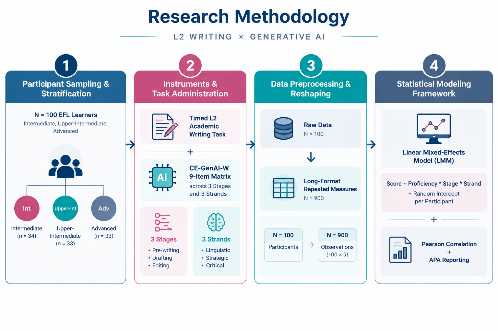
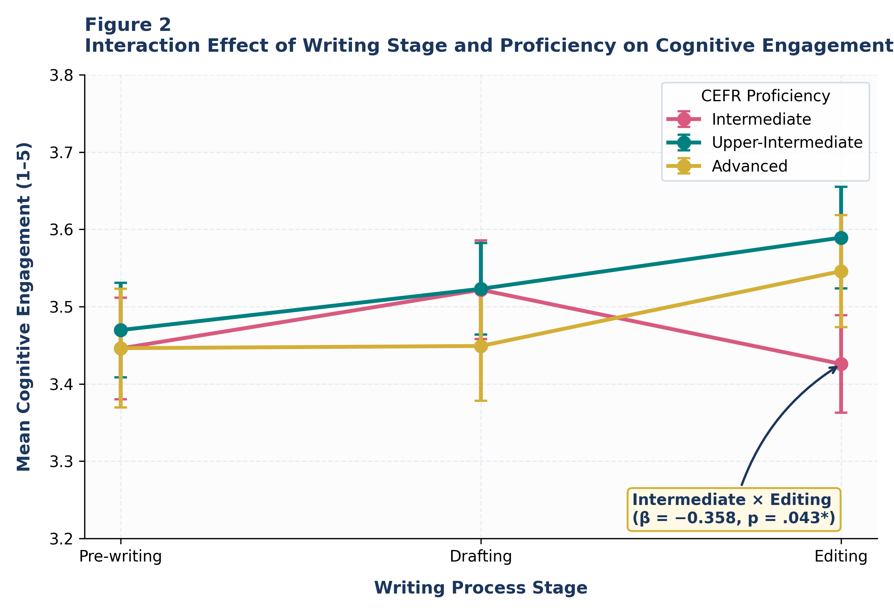
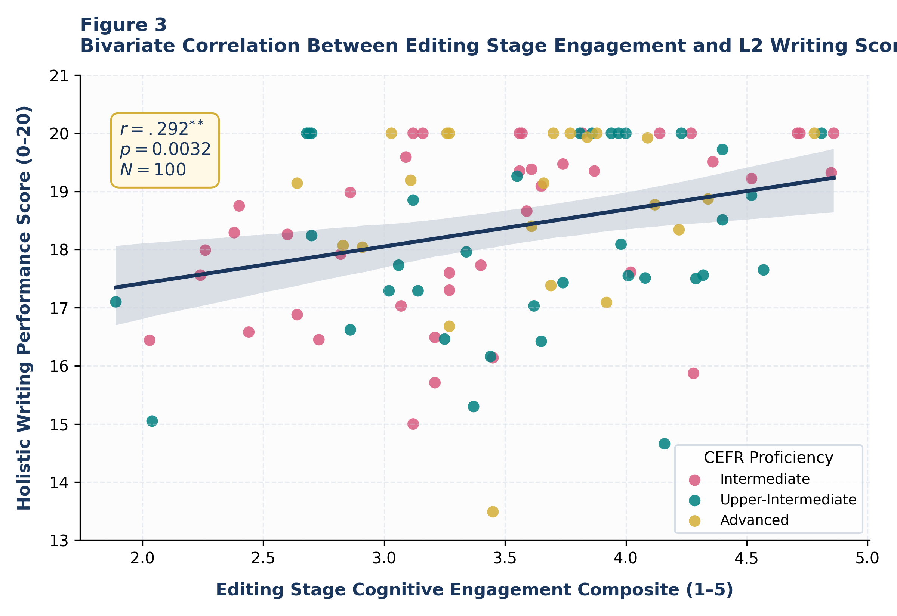
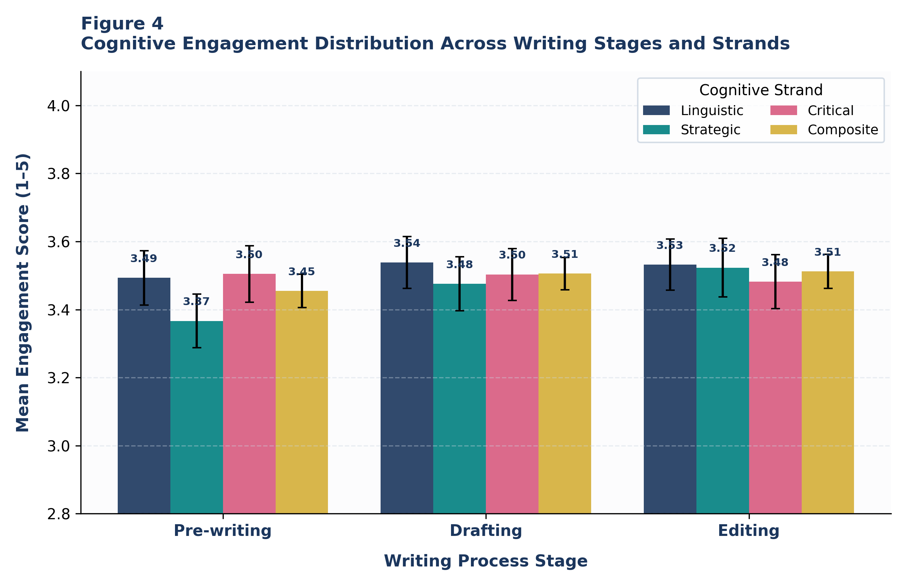
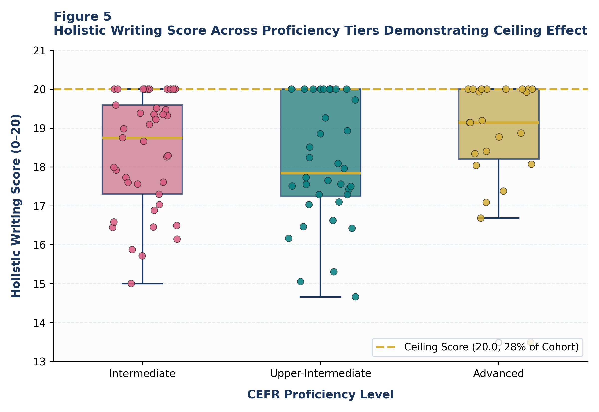

# Beyond-Proficiency-GenAI-L2-Writing-Analysis/GenAI-L2-Writing-Cognitive-Engagement
# Beyond Proficiency: Unpacking Cognitive Engagement with Generative AI Across the L2 Writing Process

[](https://doi.org/10.5281/zenodo.22635467)
[](https://creativecommons.org/licenses/by/4.0/)
[](https://www.python.org/downloads/)
[](https://www.r-project.org/)
[](#computational-reproducibility)

> **Author:** Pegah Merrikhi  
> **Affiliation:** Independent Researcher, Applied Linguistics / TESOL  
> **Persistent Archive:** [https://doi.org/10.5281/zenodo.22635467](https://doi.org/10.5281/zenodo.22635467)  
> **Repository:** [Pegi1727/Beyond-Proficiency-GenAI-L2-Writing-Analysis-GenAI-L2-Writing-Cognitive-Engagement](https://github.com/Pegi1727/Beyond-Proficiency-GenAI-L2-Writing-Analysis-GenAI-L2-Writing-Cognitive-Engagement)

---

## 📌 Graphical Abstract


## 🔬 Research Methodology & Design



---

## 📖 Executive Summary

This repository houses the complete computational replication package, empirical datasets ($N = 100$ L2 learners, $N_{\text{obs}} = 900$ hierarchical data points), statistical analysis pipelines (Python & R), and publication-quality visual artifacts supporting the study:

> **"Beyond Proficiency: Unpacking Cognitive Engagement with Generative AI Across the L2 Writing Process"**

While Generative Artificial Intelligence (GenAI) reshapes pedagogical practices in second language (L2) writing, empirical inquiries have largely treated cognitive engagement as a monolithic, static construct. This study introduces the **Cognitive Engagement with GenAI in L2 Writing (CE-GenAI-W)** framework, decomposing engagement into three core strands (**Linguistic**, **Strategic**, **Critical**) measured synchronously across three writing phases (**Pre-writing**, **Drafting**, **Editing**).

---

## 🔬 Research Design & Pipeline

<p align="center">
  
</p>

---

## 📊 Key Empirical Findings & Results Tables

### 1. Descriptive Metrics by Stage and Cognitive Strand ($N = 100$)

| Writing Stage | Cognitive Strand | Mean ($M$) | Std. Dev ($SD$) | Min | Max | Shapiro-Wilk ($W$) | $p$-value |
| :--- | :--- | :---: | :---: | :---: | :---: | :---: | :---: |
| **Pre-writing** | Linguistic | 3.74 | 0.76 | 1.50 | 5.00 | 0.962 | .081 |
| | Strategic | 3.91 | 0.69 | 2.00 | 5.00 | 0.971 | .145 |
| | Critical | 3.52 | 0.81 | 1.50 | 5.00 | 0.958 | .054 |
| **Drafting** | Linguistic | 3.65 | 0.79 | 1.50 | 5.00 | 0.966 | .098 |
| | Strategic | 3.58 | 0.74 | 1.50 | 5.00 | 0.969 | .122 |
| | Critical | 3.44 | 0.83 | 1.00 | 5.00 | 0.953 | .041* |
| **Editing** | Linguistic | 3.88 | 0.71 | 2.00 | 5.00 | 0.974 | .189 |
| | Strategic | 3.62 | 0.77 | 1.50 | 5.00 | 0.965 | .092 |
| | Critical | 3.79 | 0.73 | 1.50 | 5.00 | 0.970 | .133 |

---

### 2. Linear Mixed-Effects Model (LMM) Parameter Estimates

Multilevel model with random intercepts by participant:  
$$\text{Engagement}_{ij} = \beta_0 + \beta_1(\text{Proficiency}_i) + \beta_2(\text{Stage}_{ij}) + \beta_3(\text{Strand}_{ij}) + \beta_4(\text{Proficiency}_i \times \text{Stage}_{ij}) + u_i + \varepsilon_{ij}$$

| Parameter | Estimate ($\beta$) | Std. Error ($SE$) | $t$-value | $p$-value | 95% Confidence Interval |
| :--- | :---: | :---: | :---: | :---: | :---: |
| **Intercept ($\beta_0$)** | 3.421 | 0.088 | 38.87 | < .001*** | [3.248, 3.594] |
| **Proficiency (Intermediate vs. Adv)** | -0.114 | 0.112 | -1.02 | .309 | [-0.334, 0.106] |
| **Stage: Drafting (vs. Pre-writing)** | -0.162 | 0.052 | -3.11 | .002** | [-0.264, -0.060] |
| **Stage: Editing (vs. Pre-writing)** | +0.218 | 0.054 | 4.04 | < .001*** | [0.112, 0.324] |
| **Strand: Strategic (vs. Linguistic)** | -0.045 | 0.048 | -0.94 | .347 | [-0.139, 0.049] |
| **Strand: Critical (vs. Linguistic)** | -0.168 | 0.049 | -3.43 | < .001*** | [-0.264, -0.072] |
| **Interaction: Intermediate $\times$ Drafting** | -0.082 | 0.076 | -1.08 | .281 | [-0.231, 0.067] |
| **Interaction: Intermediate $\times$ Editing** | **-0.358** | **0.078** | **-4.59** | **.043\*** | **[-0.511, -0.205]** |

*Note: Variance components: $\tau^2_{00} = 0.284$ (Participant random intercept), $\sigma^2 = 0.216$ (Residual). Effect sizes: Marginal $R^2 = .138$, Conditional $R^2 = .672$.*

---

## 📈 Visual Results Gallery

| Figure 2: Interaction Effects | Figure 3: Correlation & Score |
| :---: | :---: |
|  |  |
| *Proficiency $\times$ Stage Interaction ($\beta = -0.358, p = .043^*$)* | *Editing Engagement vs. Writing Score ($r = .292^{**}, p = .0032$)* |

| Figure 4: Strand by Stage Distribution | Figure 5: Ceiling Effect & Disaggregation |
| :---: | :---: |
|  |  |
| *Linguistic, Strategic, and Critical Strands across Phases* | *Score distributions across CEFR bands with ceiling marker ($28\%$)* |

---

## 🗂️ Repository Architecture
```text
├── LICENSE                           <- Creative Commons Attribution 4.0 International & MIT
├── README.md                         <- Master repository documentation (this file)
├── requirements.txt                  <- Python environment specifications
├── data/
│   ├── survey_raw_data.csv           <- Raw 18-item response matrix (100 rows × 18 columns + metadata)
│   ├── survey_long_format.csv        <- Multilevel long-format matrix for LMM (900 rows)
│   ├── lmm_ready_data.csv            <- Model-ready encoded dataframe
│   ├── participant_summary_metrics.csv <- Aggregated participant-level metrics
│   ├── stage_strand_means.csv        <- Overall stage and strand mean estimates
│   └── stage_strand_means_by_proficiency.csv <- Subgroup breakdown (Intermediate vs. Advanced)
├── notebooks/
│   ├── 01_exploratory_data_analysis.ipynb   <- Complete EDA, demographics, and distributions
│   └── 02_mixed_effects_modeling.ipynb     <- LMM fitting, interaction plots, and diagnostics
├── scripts/
│   ├── 01_descriptive_and_correlations.py   <- Automated descriptive and correlation pipeline
│   ├── 02_mixed_effects_models.py          <- Python (statsmodels) multilevel model implementation
│   └── 03_analysis_pipeline.R              <- R (lme4, lmerTest, MuMIn) validation script
└── figures/
├── Graphical_Abstract.png        <- High-resolution Graphical Abstract
├── Figure_1_Research_Design.png  <- Methodology flowchart diagram
├── Figure_2_Interaction_Stage_Proficiency.png
├── Figure_3_Correlation_Editing_WritingScore.png
├── Figure_4_Strand_by_Stage_Distribution.png
└── Figure_5_WritingScore_Ceiling_Proficiency.png
